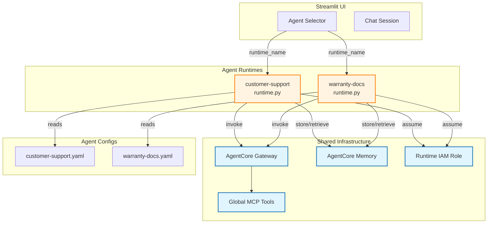
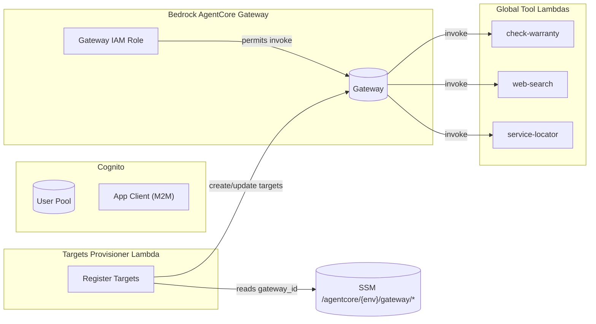

# Agents Developer Guide

This guide captures the architecture, tooling, and day-to-day workflows for developing against the Bedrock AgentCore template. It complements the quick start in [README.md](./README.md).

## Architecture

All agents share a single set of infrastructure components (Gateway, Memory, IAM roles, Observability) and differ only by runtime code and configuration.



### Shared infrastructure what/where

| Component      | Location / Module                                 | Purpose                                           |
|----------------|----------------------------------------------------|---------------------------------------------------|
| Cognito        | `infrastructure/terraform/modules/identity`        | Auth for Streamlit UI and AgentCore Gateway       |
| Gateway        | `infrastructure/terraform/modules/gateway`         | MCP endpoint for shared Lambda tools              |
| Memory         | `infrastructure/terraform/modules/memory`          | User preference + semantic memory (90-day TTL)    |
| Runtime IAM    | `infrastructure/terraform/modules/runtime`         | Execution role for AgentCore runtimes             |
| Observability  | `infrastructure/terraform/modules/observability`   | CloudWatch logs, dashboards, X-Ray, alarms        |
| Global tools   | `agents/global-tools/` + Terraform `modules/tools` | Shared Lambda-based MCP tools                     |

## Deploying an agent runtime with the AgentCore CLI

Use the AgentCore CLI whenever you change runtime code, dependencies, or configuration that lives inside the container image.

1. **Prepare the CLI configuration**
   ```bash
   cp .bedrock_agentcore_example.yaml .bedrock_agentcore.yaml
   ```
   Fill in the placeholders with absolute paths, AWS account ID, memory IDs from SSM, and (after first launch) the runtime ARN/ID values.

2. **Optional: run infrastructure preflight checks**
   ```bash
   ./scripts/infra/preflight-checks.sh dev
   ```
   Confirms credentials, Terraform lock state, and required tooling.

3. **Launch or update a runtime**
   ```bash
   agentcore launch --agent warranty_docs --local-build --auto-update-on-conflict
   agentcore launch --agent customer_support --local-build --auto-update-on-conflict
   ```
   (Omit `--agent` to deploy the `default_agent` defined in the config.)

4. **Verify deployment**
   ```bash
   agentcore status
   agentcore invoke '{"prompt": "Sanity check"}'
   ```

The CLI builds from `agents/<agent>/Dockerfile`, pushes to the configured ECR repository, and updates the runtime endpoint in Bedrock AgentCore.

## Creating or extending an agent

Follow these phases when introducing a new runtime.

### Phase 1 – Plan

1. Decide on agent purpose, primary flows, and which shared (Gateway) vs. local tools you require.
2. (Optional) Capture research and prompts under `specs/{ticket}-{agent-name}/`.

### Phase 2 – Global tools (optional)

If you need a shareable MCP tool:

1. Create `agents/global-tools/<tool_name>/` with:
   - `tool-schema.json` (uses **hyphenated** `name` value)
   - `lambda_function.py`
   - optional `requirements.txt`
   - `__init__.py`
2. Register the tool in `infrastructure/terraform/envs/<env>/terraform.tfvars`:
   ```hcl
   global_tools = [
     {
       name        = "service_locator"            # directory (underscores)
       source_dir  = "agents/global-tools/service_locator"
       description = "Locate authorised service centres"
     }
   ]
   ```
3. `terraform apply` inside the environment folder to package the Lambda and register the Gateway target.
4. Confirm registration:
   ```bash
   aws bedrock-agentcore-control list-gateway-targets \
     --gateway-identifier $(aws ssm get-parameter --name /agentcore/dev/gateway/gateway_id --query 'Parameter.Value' --output text) \
     --region us-east-1
   ```

### Phase 3 – Agent runtime skeleton

```
agents/<agent-name>/
├── Dockerfile
├── pyproject.toml
├── requirements.txt
├── runtime.py
└── tools/
    ├── __init__.py
    └── <tool modules>
```

- Model runtime on `agents/customer-support/runtime.py` or `agents/warranty-docs/runtime.py`.
- Import Strands local tools directly; load Gateway tools at runtime when an `Authorization` header is present.

### Phase 4 – Configuration

Create `agent-config/<agent-name>.yaml` with `${SSM:...}` placeholders for Gateway, Memory, Identity, and Runtime data. See existing configs for reference.

### Phase 5 – Frontend integration

Add the new agent to `services/frontend_streamlit/main.py` (`AVAILABLE_AGENTS`), provide a README, and surface documentation in `docs/` if needed.

### Phase 6 – Testing & docs

- Unit tests under `tests/unit/agents/`
- Update documentation (`agents/README.md`, `docs/README.md`)

## Tool naming conventions

- **Filesystem / Terraform**: use underscores – `my_new_tool`
- **MCP (tool-schema.json, agent configs)**: use hyphens – `my-new-tool`
- Agent configs list allowed tools using the hyphenated MCP name.

## SSM parameter conventions

Terraform writes configuration to parameter store under `/agentcore/{env}/`:

```
/agentcore/dev/
├── identity/
│   ├── pool_id
│   ├── machine_client_id
│   └── frontend_client_id
├── gateway/
│   ├── gateway_id
│   ├── gateway_arn
│   └── invoke_url
├── memory/
│   ├── memory_id
│   └── memory_arn
├── runtime/
│   ├── execution_role_arn
│   └── log_group_name
└── observability/
    ├── xray_enabled
    └── metrics_namespace
```

Agent configs reference these values using `${SSM:/agentcore/dev/...}` and `agentcore-common` resolves them at runtime.

## Gateway MCP tools in depth

Shared tools are Lambda functions registered as Gateway targets.



- Provisioner IAM allows `bedrock-agentcore:{Create,Update,Delete}GatewayTarget` and reads the Gateway ID from SSM.
- Gateway IAM role allows `lambda:InvokeFunction` against `{namespace}-*-tool-*`.
- Tool logs live under `/aws/lambda/agentcore-<tool>-tool-<env>`.

## Local testing cookbook

### Prerequisites

```bash
cd infrastructure/terraform/envs/dev
terraform apply                # ensure infra exists
cd -
uv sync                         # install project deps
```

### Methods at a glance

| Method                      | Command / Script                                      | Notes |
|-----------------------------|-------------------------------------------------------|-------|
| Streamlit UI                | `AGENTCORE_ENV=dev AWS_REGION=us-east-1 uv run streamlit run services/frontend_streamlit/main.py` | Full stack, auth required |
| Local dev helper            | `./scripts/local/start-local-dev.sh <agent-id>`       | Fast inner loop, spins up UI + runtime |
| Runtime (no UI)             | `./scripts/local/run-agent-local.sh <agent-id> "Prompt"` | Helpful for debugging stdout logs |
| Docker smoke test           | `./scripts/local/run-agent-docker.sh <agent-id> "Prompt"` | Matches Lambda base image |
| Unit tests                  | `uv run pytest tests/unit/agents/ -v`                 | Uses mocks, fastest feedback |
| End-to-end tests            | `uv run pytest tests/e2e/ -v`                         | Calls AWS services; ensure budget |

### Recommended workflow

1. Unit test local tools and utility functions.
2. Run `run-agent-local.sh` for quick prompt checks.
3. Use the Docker helper before committing to ensure container packaging works.
4. Redeploy via `agentcore launch` and validate with `agentcore invoke`.
5. Smoke test the Streamlit UI if user flows change.

### Sample commands

```bash
# Local runtime only
./scripts/local/run-agent-local.sh warranty-docs "List compatible accessories for laptop-x1"

# Docker container
./scripts/local/run-agent-docker.sh customer-support "Help me reset my password"

# Unit tests for warranty-docs tools
uv run pytest tests/unit/agents/test_warranty_docs.py -v
```

## Automated testing

```bash
# All unit tests (fast)
uv run pytest tests/unit/agents/ -v

# Specific agent with coverage
uv run pytest tests/unit/agents/test_warranty_docs.py --cov=agents/warranty-docs --cov-report=term-missing -v

# Full suite (includes e2e tests)
uv run pytest tests/ -v
```

## Troubleshooting cheat sheet

- **Gateway tools missing:** Verify target registration (`aws bedrock-agentcore-control list-gateway-targets`) and Lambda logs. Ensure hyphenated tool names in config.
- **Runtime cannot find memory:** Check SSM values; run `agentcore status` and confirm Terraform-managed memory exists.
- **Authentication issues:** Confirm Cognito user creation steps in the quick start, or reset passwords via `aws cognito-idp admin-set-user-password`.
- **Bedrock permissions errors:** Verify the runtime IAM policy in `modules/runtime` allows the target foundation model (e.g., `anthropic.claude-*`).

## Further reading

- [`agents/README.md`](./README.md) – quick start and operator view
- [`infrastructure/terraform/README.md`](../infrastructure/terraform/README.md) – module details
- [`services/frontend_streamlit/README.md`](../services/frontend_streamlit/README.md) – UI customisation
- [`documents in agents/global-tools/`](./global-tools) – individual tool implementations

_Last updated: 2025-10-29_
