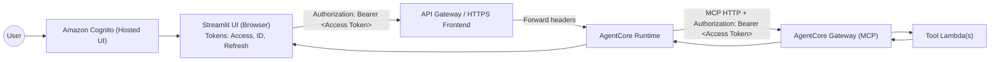
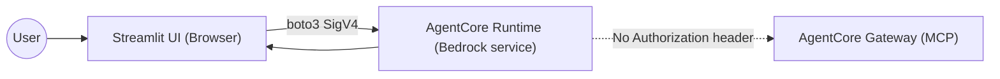

# Security Architecture and Token Flows

This document describes how authentication and authorization work across the Streamlit UI, AgentCore Runtime, and AgentCore Gateway in this template. It also lists recommended best practices and the secrets involved.

Last updated: 2025-11-01

**Key recent changes (2025-11-01)**

- Terraform now publishes additional SSM parameters under `/agentcore/{env}/identity/*`:
  - `client_id` (alias of the machine-to-machine Cognito client ID)
  - `cognito_domain` (alias of the user pool domain)
  - `scope` (default OAuth2 scope string, default: `openid`)
- Agent runtimes (customer-support and warranty-docs) were updated to:
  - Prefer the caller’s `Authorization: Bearer ...` header when invoking Gateway tools
  - Fall back to acquiring a machine-to-machine token (client_credentials) using the above SSM values when no caller header is available

## Overview

- Identity provider: Amazon Cognito Hosted UI (OAuth2 + PKCE)
- User tokens: Cognito Access Token and ID Token (JWT)
- Runtime invocations: AWS SigV4 (your AWS credentials) to Bedrock AgentCore Runtime service
- Gateway invocations: Model Context Protocol (MCP) over HTTP with Authorization: Bearer <Cognito Access Token>
- Configuration and secrets are discovered via SSM Parameter Store at `/agentcore/{env}/*` (never hardcoded)

## High-level flows

### 1) User login and token acquisition (UI ↔️ Cognito)

- Streamlit uses Cognito Hosted UI with PKCE to obtain:
  - Access Token (JWT): used for API/Gateway authorization
  - ID Token (JWT): used by the UI to display user profile (no security decisions)
  - Refresh Token (optional): used to refresh the Access Token

### 2) UI → AgentCore Runtime

- Local/dev mode (this template default): the Streamlit app calls the AgentCore Runtime service directly using AWS credentials (SigV4). No OAuth Authorization header is carried along in this path.
- Deployed/edge pattern (recommended for production): front the runtime with an HTTPS/API layer (e.g., API Gateway/Lambda URL/ALB) protected by Cognito. The UI includes `Authorization: Bearer <Access Token>` on requests. The platform forwards request headers to the Runtime context.

### 3) Runtime → AgentCore Gateway (MCP tools)

- Gateway requires an Authorization Bearer token (Cognito Access Token) from the original caller. The runtime passes through the caller’s `Authorization` header when connecting to the Gateway over MCP/HTTP.
- If the runtime does not receive an Authorization header (e.g., direct SigV4 invocation), it continues with local tools only and skips Gateway tools.

## Sequence diagrams

### Production path (recommended)

### Local/dev path (default in this template)

## Tokens and headers

- Cognito Access Token (JWT)
  - Format: `Authorization: Bearer <access_token>`
  - Who issues: Amazon Cognito
  - Who validates:
    - API front door (e.g., API Gateway Cognito Authorizer) for UI→Runtime
    - AgentCore Gateway for Runtime→Gateway MCP calls
  - Lifetime: Typically ~1 hour (configurable in Cognito)

- Cognito ID Token (JWT)
  - Purpose: UI-only claims (email, username); not used for authorization
  - Validated client-side only for display; do not rely on it for authZ

- Refresh Token
  - Used by UI to refresh the Access Token silently
  - Never sent to Runtime or Gateway

- AWS SigV4
  - Used when the UI calls Bedrock AgentCore Runtime service directly via boto3
  - Signs the request with AWS credentials; no OAuth header exists in this path

## Where this appears in the code

- UI tokens: `frontend/streamlit_app/auth.py`
  - Retrieves Access/ID/Refresh tokens from Cognito
- UI → Runtime: `frontend/streamlit_app/runtime_client.py`
  - Uses boto3 with SigV4 to call `bedrock-agentcore.invoke_agent_runtime`
  - Does not send `Authorization` (OAuth) header
- Runtime → Gateway: `agents/customer-support/runtime.py`
  - Reads `context.request_headers["Authorization"]`
  - If present, forwards it to the Gateway MCP client
  - If absent, attempts to acquire a machine-to-machine OAuth token using Cognito client credentials resolved from SSM (`identity.client_id`, `identity.client_secret`, `identity.cognito_domain`, `identity.scope`)
  - Falls back to local tools only if token acquisition fails
- Runtime → Gateway: `agents/warranty-docs/runtime.py`
  - Mirrors the same Authorization handling as customer-support (caller token preferred, M2M fallback)

## Gateway tools are MCP

- Tools live under `agents/global-tools/*` and each has a `tool-schema.json` (MCP schema) and `lambda_function.py`.
- Terraform module `infrastructure/terraform/modules/tools` deploys each tool as a Lambda and registers it as a Gateway Target by reading its `tool-schema.json` (see `locals.registration_tools`).
- Registration is performed by a custom resource Lambda (`custom-resources/agentcore-gateway-targets`) invoked from Terraform. Gateway Targets are idempotently created/updated using the schema-defined MCP name.

## Secrets and configuration

- SSM Parameter Store
  - Prefix: `/agentcore/{env}/*` (e.g., `/agentcore/dev/gateway/gateway_id`)
  - Agent configs may include `${SSM:...}` placeholders; resolved at runtime by `agentcore-common`.
  - Identity-related parameters provided by Terraform:
    - `/identity/pool_id`, `/identity/pool_arn`
    - `/identity/machine_client_id`, `/identity/client_id` (alias)
    - `/identity/client_secret`
    - `/identity/domain`, `/identity/cognito_domain` (alias)
    - `/identity/scope` (default OAuth scope)
  - Never hardcode ARNs/URLs; discover via SSM.

- Cognito App Client Secret
  - Used by UI to exchange authorization code for tokens.
  - Keep in backend-only configuration; do not expose to browsers or logs.

- AWS credentials (SigV4)
  - Used by the UI process to invoke Bedrock AgentCore services directly during local/dev.
  - Follow least-privilege IAM and avoid long-lived static credentials.

## Security best practices

1) Prefer the production path with an API front door enforcing Cognito
   - Ensure `Authorization: Bearer <Access Token>` is required and validated at the edge
   - Forward the `Authorization` header to the Runtime so it can reach Gateway tools

2) Runtime should pass through only the caller’s `Authorization` header
   - Do not mint or substitute tokens inside the Runtime
   - Avoid sharing refresh tokens or ID tokens beyond the UI

3) Scope IAM narrowly
   - Runtime execution role: only Bedrock model family access needed; no wildcards beyond AWS service requirements
   - Tool Lambda roles: least privilege to their backing APIs/data
   - Gateway registration Lambda: restrict Bedrock AgentCore Gateway actions and SSM path scopes

4) Protect secrets and logs
   - Never log tokens or secrets; set `LOG_LEVEL` appropriately
   - Use SSM for configuration discovery; avoid plaintext secrets in code

5) Local/dev expectations
   - When invoking Runtime directly (SigV4), expect Gateway tools to be unavailable due to missing OAuth header
   - To exercise Gateway tools locally, front the Runtime with a Cognito-protected endpoint or use a developer token mechanism at the edge (never embed in code)

## Threat model highlights

- Replay protection: PKCE for OAuth login; clear query params after exchange to prevent code reuse
- Token scope: use Access Token for authorization; avoid using ID Token for authZ
- Token lifetime: keep Access Token short-lived; rely on Refresh Token in UI only
- Header forwarding: ensure edge → Runtime header propagation is enabled and sanitized (do not forward unrelated sensitive headers)

## References

- Repository conventions: `.github/copilot-instructions.md`
- Tools and registration: `infrastructure/terraform/modules/tools/main.tf`
- UI auth: `frontend/streamlit_app/auth.py`, `frontend/streamlit_app/main.py`
- Runtime: `agents/customer-support/runtime.py`, `agents/warranty-docs/runtime.py`
