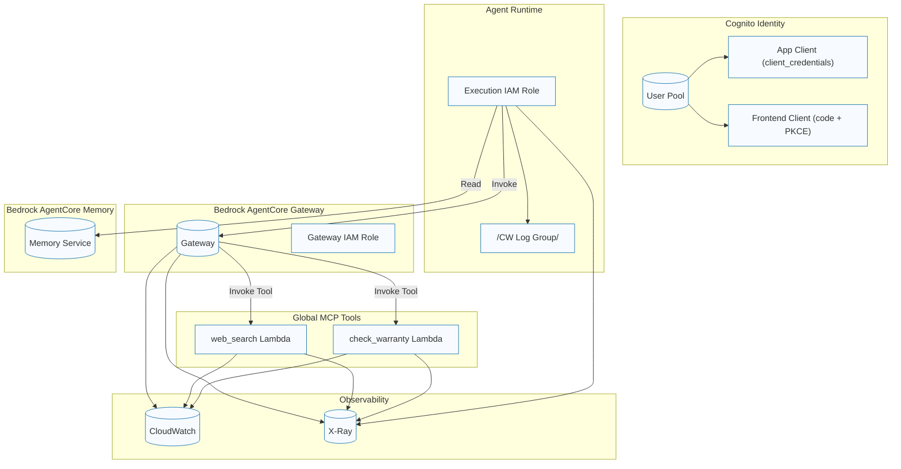

# Infrastructure as Code — Terraform

This stage provisions the shared, agent-agnostic foundation for Amazon Bedrock AgentCore using Terraform. It follows the Infrastructure-first principle (IaC > SDK) and deploys once per environment (dev/staging/prod). Agent code is deployed separately in Phase 2.

## Prerequisites

- Terraform >= 1.7, AWS CLI, configured AWS credentials (profile or SSO)
- Set your default region (e.g., us-east-1)
- Chosen environment name (dev/staging/prod)
- **Backend configuration**: S3 bucket for Terraform state (see globals/backend.tfvars)
- **Environment tfvars**: infrastructure/terraform/envs/{env}/terraform.tfvars

## Quick Start (dev)

```bash
# From repo root
cd infrastructure/terraform/envs/dev

# Ensure terraform.tfvars exists (see variables.tf for required variables)
# If missing, create it with at minimum: agent_namespace, global_tools

# Initialize with backend configuration
terraform init -backend-config=../../globals/backend.tfvars

# Plan and apply
terraform plan -out plan.tfplan
terraform apply plan.tfplan
```

## What gets deployed

- Identity (Cognito)
	- User Pool, M2M client (client_credentials), Frontend client (authorization_code + PKCE), Resource Server (scopes), Hosted UI domain
	- SSM: `/agentcore/{env}/identity/*` (pool_id, pool_arn, machine_client_id, client_secret [SecureString], frontend_client_id, frontend_client_secret [SecureString], domain)

- Gateway (Bedrock AgentCore Gateway)
	- IAM role for Gateway to invoke tool Lambdas
	- Custom Resource Lambda to create/update/delete the Gateway and store outputs in SSM
	- SSM: `/agentcore/{env}/gateway/*` (gateway_id, gateway_arn, invoke_url, role_arn)

- Runtime (IAM execution role for agents)
	- Trust: bedrock.amazonaws.com, bedrock-agentcore.amazonaws.com, lambda.amazonaws.com (back-compat)
	- Policies: Bedrock invocation (model-family scoped), SSM read (scoped to `/agentcore/{env}/*`), CloudWatch Logs, optional X-Ray, Gateway invoke, ECR pull, dedicated Bedrock AgentCore memory access
	- SSM: `/agentcore/{env}/runtime/*` (execution_role_{arn,name}, log_group_name, xray_enabled)

- Memory (Bedrock AgentCore Memory)
	- Custom Resource Lambda to create/update/delete Memory and store outputs in SSM
	- SSM: `/agentcore/{env}/memory/*` (memory_id, memory_arn, enabled_strategies, plus strategy settings)

- Observability (CloudWatch + optional KMS + X-Ray)
	- Log groups: `/aws/agentcore/{env}/{invocations|tools|gateway}`
	- X-Ray sampling rule, metric filters, alarms (Gateway latency/errors, Memory throttles/latency), dashboard

- Tools (Global MCP tool Lambdas + Gateway Target registration)
	- One Lambda per tool (`{namespace}-{tool}-tool-{env}`), X-Ray + CW logs (default tools: `check_warranty`, `service_locator`, `web_search`)
	- Custom Resource Lambda to register/update Gateway Targets for each tool using the Gateway ID from SSM

## IAM highlights (least privilege)

- Runtime
	- bedrock:InvokeModel/InvokeModelWithResponseStream → `foundation-model/anthropic.claude-*`, `foundation-model/amazon.titan-*`
	- bedrock-agentcore:{CreateEvent,GetEvent,GetMemory,GetMemoryRecord,ListMemoryRecords,QueryMemory} → `memory/*`
	- ssm:GetParameter/GetParameters/GetParametersByPath → `parameter/agentcore/{env}/*`
	- lambda:InvokeFunction → `function:{namespace}-*-tool-*`
	- ecr:GetAuthorizationToken → "*" (service requires *)
	- ecr:BatchGetImage/GetDownloadUrlForLayer → `repository/bedrock-agentcore-*`

- Gateway provisioner Lambda
	- bedrock-agentcore:Create*/Get*/Update*/Delete*/List* → `arn:aws:bedrock-agentcore:{region}:{account}:*` (broad; see Notes)
	- iam:PassRole (to Gateway role) with `iam:PassedToService=bedrock-agentcore.amazonaws.com`
	- ssm:{Put,Get,Delete}Parameter, AddTagsToResource → `parameter/agentcore/{env}/gateway/*`
	- ssm:GetParameter → `parameter/agentcore/{env}/identity/*`

- Memory provisioner Lambda
	- bedrock-agentcore:Create*/Get*/Update*/Delete*/List* → `*` (see Notes)
	- bedrock:InvokeModel → `foundation-model/amazon.titan-embed-*` (semantic memory)
	- ssm:{Put,Get,Delete}Parameter → `parameter/agentcore/{env}/memory/*`

- Tools targets provisioner Lambda
	- bedrock-agentcore:CreateGatewayTarget/Get*/Update*/List*/Delete* → `*` (see Notes)
	- ssm:GetParameter(s) → `parameter/agentcore/{env}/gateway/*`

Notes on wildcards:
- ECR GetAuthorizationToken only supports Resource="*".
- Bedrock model ARNs are family-scoped by design (versions change); using `anthropic.claude-*`/`amazon.titan-*` is the narrowest practical scope.
- Bedrock AgentCore control-plane actions (Gateway/Memory/Targets) currently use broad resource scopes in IAM due to API constraints and resource creation flows. As AWS publishes more granular resource ARNs/conditions, tighten to `...:gateway/*`, `...:memory/*` where possible.

## SSM parameter map

All module outputs are stored under `/agentcore/{env}/{component}/*`:
- identity: pool_id, pool_arn, machine_client_id, client_secret (SecureString), frontend_client_id, frontend_client_secret (SecureString), domain
- gateway: gateway_id, gateway_arn, invoke_url, role_arn
- runtime: execution_role_arn, execution_role_name, log_group_name, xray_enabled
- memory: memory_id, memory_arn, enabled_strategies, strategy settings

Consumers:
- Gateway provisioner reads `/agentcore/{env}/identity/*` to configure JWT authorizer
- Tools target provisioner reads `/agentcore/{env}/gateway/*` to register targets
- Agents read `/agentcore/{env}/runtime/*` and `/agentcore/{env}/memory/*`

## Cleanup opportunities (dev focus)

- Knowledge Base module is optional (disabled by default via `knowledge_enabled=false`). Keep module wired, but deploy only when needed. No action required.
- IAM tightening candidates (future): narrow bedrock-agentcore Resource ARNs once AWS publishes per-resource patterns accepted at Create time; document and track.
- Frontend callback URLs are configured for localhost; ensure additional domains are added per environment before staging/prod.

## Architecture

Below is the high-level architecture. This is equivalent to `docs/diagrams/infra-overview.mmd` and renders inline for convenience.



## Validation

- terraform fmt/validate: must pass in `infrastructure/terraform/envs/{env}`
- After deploy, verify SSM parameters exist for identity, gateway, runtime, memory
- Check CloudWatch dashboard and alarms (observability module)

## Troubleshooting
-## FAQs

- Q: Why are some IAM resources scoped with wildcards?
	- A: ECR authorization and Bedrock control-plane actions require broader scopes today. We document each case and tighten as AWS supports granular ARNs/conditions.
- Q: Where do agents read configuration from?
	- A: SSM Parameter Store under `/agentcore/{env}/*` populated by Terraform and custom resources.


- Gateway custom resource fails with ParameterNotFound/AccessDenied for identity: ensure identity module was applied and that the provisioner reads from `/agentcore/{env}/identity/*` (fixed in this repo).
- Memory semantic strategy requires Bedrock embedding model access in the provisioner role.
