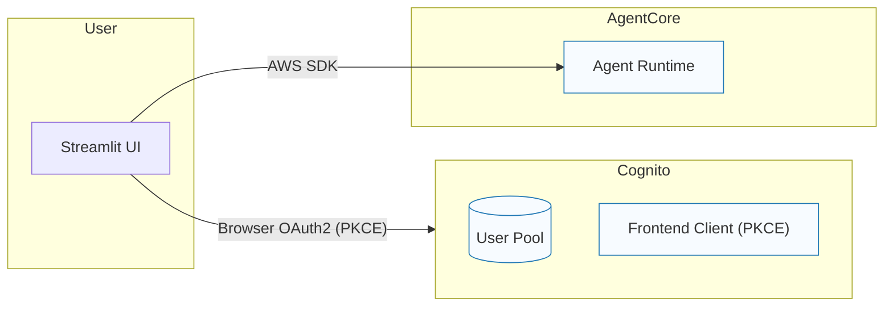

# Frontend (Streamlit)

Concise frontend stage documentation for the Streamlit UI.

## Prerequisites

- Terraform Identity and Runtime stages applied
- AWS credentials configured (profile or SSO), region set

## Architecture

This diagram renders inline and mirrors `docs/diagrams/frontend.mmd`.



## What it does

- Provides a chat UI for interacting with an AgentCore runtime
- Authenticates end users with Cognito (Authorization Code + PKCE)
- Invokes the AgentCore Runtime via the AWS SDK (see `runtime_client.py`)

## Resources and connections

- Cognito User Pool + Frontend App Client (from Terraform Identity module)
  - SSM: `/agentcore/{env}/identity/{pool_id,frontend_client_id,frontend_client_secret,domain}`

- Runtime invocation
  - `runtime_client.py` discovers the runtime ARN via AgentCore control plane and calls `bedrock-agentcore.invoke_agent_runtime`
  - Uses AWS credentials available to the app (for local dev, your profile)

## Quick start

```bash
# From repo root
uv sync
uv run streamlit run services/frontend_streamlit/main.py
```

Environment hints:
- `AGENTCORE_ENV` (default: dev), `AWS_REGION` (default: us-east-1)
- Use a configured `AWS_PROFILE` for SDK calls

## Project structure

```
services/frontend_streamlit/
├── main.py         # UI entrypoint
├── auth.py         # Cognito (OAuth2 + PKCE)
├── runtime_client.py  # AgentCore runtime client
├── config.py       # SSM config helpers
└── components.py   # UI components
```

## Notes

- Cognito login secures the UI; runtime invocation uses AWS SDK credentials.
- For production, run behind HTTPS and update Cognito callback/logout URLs accordingly.
